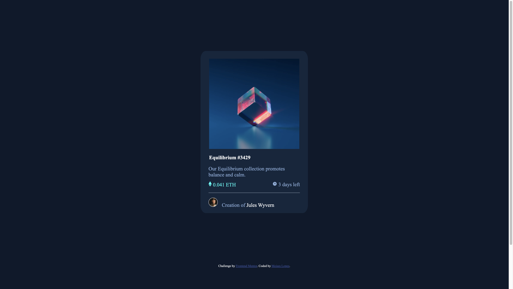
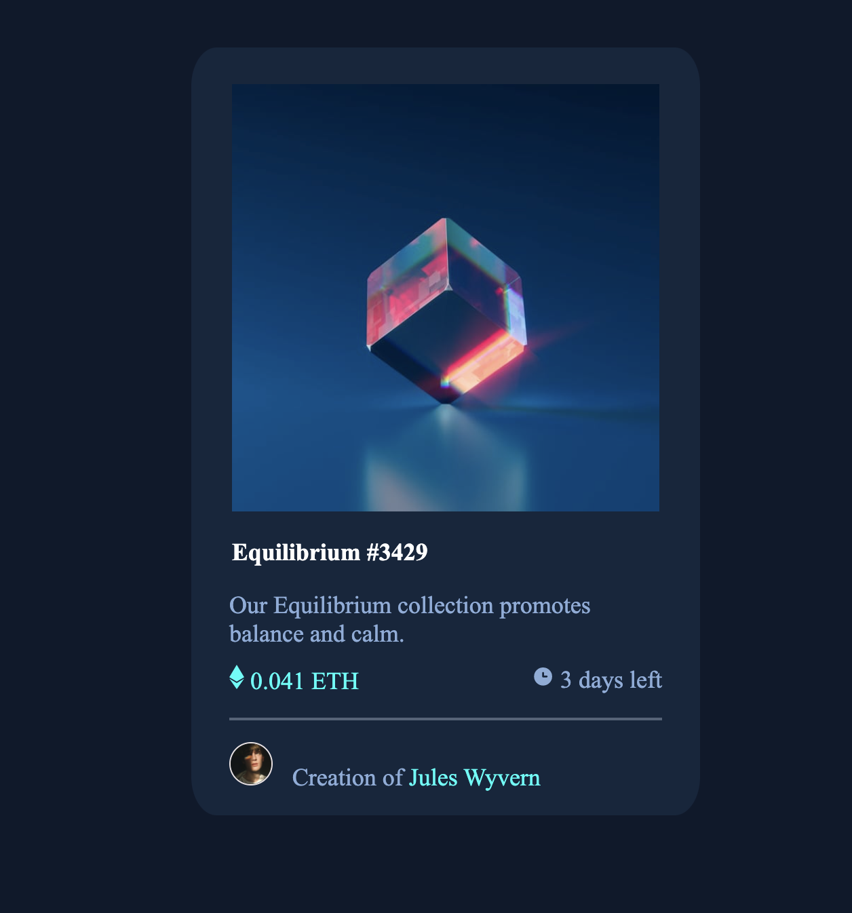

# Frontend Mentor - NFT preview card component solution

This is a solution to the [NFT preview card component challenge on Frontend Mentor](https://www.frontendmentor.io/challenges/nft-preview-card-component-SbdUL_w0U). Frontend Mentor challenges help you improve your coding skills by building realistic projects. 

## Table of contents

- [Overview](#overview)
  - [The challenge](#the-challenge)
  - [Screenshot](#screenshot)
  - [Built with](#built-with)
  - [What I learned](#what-i-learned)
  - [Continued development](#continued-development)
  - [Useful resources](#useful-resources)
- [Author](#author)

## Overview

### The challenge

Users should be able to:

- View the optimal layout depending on their device's screen size
- See hover states for interactive elements

### Screenshot





Add a screenshot of your solution. The easiest way to do this is to use Firefox to view your project, right-click the page and select "Take a Screenshot". You can choose either a full-height screenshot or a cropped one based on how long the page is. If it's very long, it might be best to crop it.

Alternatively, you can use a tool like [FireShot](https://getfireshot.com/) to take the screenshot. FireShot has a free option, so you don't need to purchase it. 

Then crop/optimize/edit your image however you like, add it to your project, and update the file path in the image above.

**Note: Delete this note and the paragraphs above when you add your screenshot. If you prefer not to add a screenshot, feel free to remove this entire section.**


### Built with

- Semantic HTML5 markup
- CSS custom properties
- Mobile-first workflow

### What I learned

Use this section to recap over some of your major learnings while working through this project. Writing these out and providing code samples of areas you want to highlight is a great way to reinforce your own knowledge.

To see how you can add code snippets, see below:

```html
 <figure>
        
        
        <figcaption>Equilibrium #3429</figcaption>
```
```css
html
{
    font-family: Outfit;
    color:white;
    font-size: 18px;

}
body
{
    background: hsl(217, 54%, 11%);
    
    min-height: 100vh;
    width: 100%;
}
```


### Continued development

I want to work on development my thining process when encountering any project. I realize in this project that I didn't need to use flexbox and however, I could have avoided this by
thinking more thoroughly about the assignment. Additionally, I need to work on incoprating the "roll-over effect" I had trouble doing the image roll over effect.

### Useful resources

- [Resource1] -> This helped me ensure that my page was full width and height https://www.youtube.com/watch?v=dpuKVjX6BJ8&t=948s


## Author

- Website - [Moises Lopez](https://www.linkedin.com/in/moises-lopez-b20b33187/)
- Frontend Mentor - [@@Moises-knows](https://www.frontendmentor.io/profile/Moises-knows)
